# LoomLanes-Engine: Distributed Priority Task Scheduler

**LoomLanes-Engine** is a high-throughput, low-latency distributed task scheduling system designed to handle millions of jobs with absolute reliability. Built on **Java 21 (Project Loom)** and **Spring Boot 3.x**, it leverages **Virtual Threads** to achieve massive concurrency while maintaining a clean, synchronous programming model.

[](https://www.oracle.com/java/technologies/javase/21-relnote-issues.html)
[](https://spring.io/projects/spring-boot)
[]()
[]()

---

## 🏗 High-Level Architecture (HLD)

The system is designed for massive scale, decoupling task ingestion from execution through a multi-stage priority pipeline.

```mermaid
flowchart TD
    %% Node Definitions
    Client([💻 External Client])
    
    subgraph Ingestion_Layer ["1. Ingestion Layer (Spring Boot)"]
        direction TB
        Controller[Task Controller]
        Limiter{Rate Limiter}
        LuaScript[[Redis Lua Script]]
    end

    subgraph Priority_Orchestration ["2. Priority Orchestration (Redis)"]
        direction TB
        P_Queue[(Redis Sorted Set)]
        Poller[Scheduled Task Poller]
    end

    subgraph Message_Backbone ["3. Message Backbone (Kafka)"]
        direction TB
        KafkaTopic[[Kafka: task-execution-topic]]
        DLQ[[Kafka: Dead Letter Queue]]
    end

    subgraph Execution_Engine ["4. Execution Engine (Project Loom)"]
        direction TB
        Workers[Worker Pool]
        VThread(((Virtual Thread)))
        Idempotency{Idempotency Check}
        Logic[Business Logic]
    end

    subgraph Monitoring ["Observability Stack"]
        Actuator[Spring Actuator] --> Prom[Prometheus] --> Graf[Grafana]
    end

    %% Flow Connections
    Client ==>|POST /task| Controller
    Controller --> Limiter
    Limiter -.->|Atomic Check| LuaScript
    Limiter ==>|Allowed| P_Queue
    
    P_Queue ==>|ZPOPMIN| Poller
    Poller ==>|Publish| KafkaTopic
    
    KafkaTopic ==>|Consume| Workers
    Workers --> VThread
    VThread --> Idempotency
    Idempotency -.->|SETNX| LuaScript
    Idempotency ==>|Success| Logic
    
    Logic -.->|Failures| DLQ

    %% Styling
    classDef ingestion fill:#e1f5fe,stroke:#01579b,stroke-width:2px;
    classDef priority fill:#fff3e0,stroke:#e65100,stroke-width:2px;
    classDef message fill:#f3e5f5,stroke:#4a148c,stroke-width:2px;
    classDef execution fill:#e8f5e9,stroke:#1b5e20,stroke-width:2px;
    classDef monitoring fill:#eceff1,stroke:#263238,stroke-width:1px,stroke-dasharray: 5 5;

    class Controller,Limiter ingestion;
    class P_Queue,Poller priority;
    class KafkaTopic,DLQ message;
    class Workers,VThread,Idempotency execution;
    class Monitoring monitoring;
```



## 🛠 Tech Stack

-   **Runtime**: Java 21 (Project Loom / Virtual Threads).
-   **Framework**: Spring Boot 3.4.x.
-   **Storage/State**: Redis (Rate Limiting, Priority Queue, Idempotency Locks).
-   **Messaging**: Apache Kafka (Distributed commit log for job reliability).
-   **Infrastructure**: Docker Desktop (Host) & WSL-Fedora (Build/Runtime).
-   **Observability**: Micrometer + Prometheus + Grafana.

## ⚡ Key Performance Features

-   **Zero-Blocking Execution**: Leverages **Java 21 Virtual Threads** to handle high-I/O tasks (Redis/Kafka calls) without thread exhaustion or OS context-switching overhead. This allows the system to scale to millions of concurrent tasks on a single node.
-   **Atomic Rate Limiting**: Distributed Token Bucket implemented via **Redis Lua scripts** to ensure sub-millisecond overhead and prevent race conditions in a distributed environment.
-   **Distributed Idempotency**: Guaranteed **Exactly-Once processing** using Redis `SETNX` distributed locking, preventing duplicate task execution during Kafka re-deliveries.
-   **Smart Priority Lanes**: Uses **Redis Sorted Sets (ZSet)** to manage priority buffering (O(log N) insertion), ensuring high-priority tasks are dispatched to Kafka before low-priority ones.
-   **Resilient Pipeline**: Integrated **Dead Letter Queue (DLQ)** with **Exponential Backoff** (2s, 4s, 8s) to handle transient failures gracefully.

## 💻 Hybrid Performance Architecture

This project utilizes a **Cross-Platform Bridge** for high-performance development:
*   **Runtime/Build**: Fedora (WSL) — Optimized for Linux native filesystem I/O (`ext4`).
*   **Infrastructure**: Docker Desktop (Windows) — Orchestrating Redis, Kafka, and Prometheus.
*   **Bridge**: Custom WSL-IP bridging to allow Docker containers to scrape metrics from the application layer.

## 📈 Performance & Observability

The visualization below demonstrates a **1,000-task burst** load test:
- **Yellow Line (Success)**: Stable throughput handled by Virtual Threads.
- **Green Line (Retries/Failures)**: The engine successfully isolating `FAIL_ME` tasks into the DLQ strategy without impacting the main ingestion lane.


## 🚀 Getting Started

### Prerequisites
- Docker Desktop (WSL Integration enabled for Fedora)
- Java 21 JDK & Maven 3.9+ (Installed in WSL)

### 1. Start Infrastructure
```bash
docker compose up -d
```

### 2. Configure WSL Network Bridge
Find your WSL IP: `ip addr show eth0`. Update `prometheus.yml` with this IP to allow the Prometheus container to scrape the application.

### 3. Build and Run
```bash
./mvnw clean install
./mvnw spring-boot:run
```

## 📈 Monitoring Endpoints
- **Prometheus Dashboard**: `http://localhost:9091`
- **Grafana Metrics**: `http://localhost:3000` (User: `admin`, Pass: `admin`)
- **Actuator JSON**: `http://localhost:8080/actuator/prometheus`

---
**Author**: Saksham Gupta 

**Status**: Milestone 2 Complete (Resilience & Monitoring)
