# 🚀 LoomLanes-Engine: Distributed Priority Task Scheduler

**LoomLanes-Engine** is a high-throughput, low-latency distributed task scheduling system designed to handle millions of jobs with absolute reliability. Built on **Java 21 (Project Loom)** and **Spring Boot 3.x**, it utilizes **Virtual Threads** to achieve massive concurrency while maintaining a clean, synchronous programming model.

[](https://www.oracle.com/java/technologies/javase/21-relnote-issues.html)
[](https://spring.io/projects/spring-boot)
[]()

---

## 🏗 High-Level Architecture (HLD)

The system is designed for massive scale, decoupling task ingestion from execution through a multi-stage priority pipeline.

```mermaid
flowchart TD
    %% Node Definitions
    Client([💻 External Client])
    
    subgraph Ingestion_Layer ["1. Ingestion Layer (Spring Boot)"]
        direction TB
        Controller[Task Controller]
        Limiter{Rate Limiter}
        LuaScript[[Redis Lua Script]]
    end

    subgraph Priority_Orchestration ["2. Priority Orchestration (Redis)"]
        direction TB
        P_Queue[(Redis Sorted Set)]
        Poller[Scheduled Task Poller]
    end

    subgraph Message_Backbone ["3. Message Backbone (Kafka)"]
        direction TB
        KafkaTopic[[Kafka: task-execution-topic]]
        DLQ[[Kafka: Dead Letter Queue]]
    end

    subgraph Execution_Engine ["4. Execution Engine (Project Loom)"]
        direction TB
        Workers[Worker Pool]
        VThread(((Virtual Thread)))
        Idempotency{Idempotency Check}
        Logic[Business Logic]
    end

    subgraph Monitoring ["Observability Stack"]
        Actuator[Spring Actuator] --> Prom[Prometheus] --> Graf[Grafana]
    end

    %% Flow Connections
    Client ==>|POST /task| Controller
    Controller --> Limiter
    Limiter -.->|Atomic Check| LuaScript
    Limiter ==>|Allowed| P_Queue
    
    P_Queue ==>|ZPOPMIN| Poller
    Poller ==>|Publish| KafkaTopic
    
    KafkaTopic ==>|Consume| Workers
    Workers --> VThread
    VThread --> Idempotency
    Idempotency -.->|SETNX| LuaScript
    Idempotency ==>|Success| Logic
    
    Logic -.->|Failures| DLQ

    %% Styling
    classDef ingestion fill:#e1f5fe,stroke:#01579b,stroke-width:2px;
    classDef priority fill:#fff3e0,stroke:#e65100,stroke-width:2px;
    classDef message fill:#f3e5f5,stroke:#4a148c,stroke-width:2px;
    classDef execution fill:#e8f5e9,stroke:#1b5e20,stroke-width:2px;
    classDef monitoring fill:#eceff1,stroke:#263238,stroke-width:1px,stroke-dasharray: 5 5;

    class Controller,Limiter ingestion;
    class P_Queue,Poller priority;
    class KafkaTopic,DLQ message;
    class Workers,VThread,Idempotency execution;
    class Monitoring monitoring;
```



## 🛠 Tech Stack

-   **Runtime**: Java 21 (Project Loom / Virtual Threads).
-   **Framework**: Spring Boot 3.4.x.
-   **Storage/State**: Redis (Rate Limiting, Priority Queue, Idempotency Locks).
-   **Messaging**: Apache Kafka (Distributed commit log for job reliability).
-   **Infrastructure**: Docker Desktop (Host) & WSL-Fedora (Build/Runtime).
-   **Observability**: Micrometer + Prometheus + Grafana.

## ⚡ Key Performance Features

-   **Zero-Blocking Execution**: Leverages Java 21 Virtual Threads to handle high-I/O tasks (Redis/Kafka calls) without thread exhaustion or OS context-switching overhead.
-   **Atomic Rate Limiting**: Distributed Token Bucket implemented via Redis Lua scripts to ensure sub-millisecond overhead.
-   **Distributed Idempotency**: Guaranteed "exactly-once" processing using Redis `SETNX` distributed locking.
-   **Smart Priority Lanes**: Redis Sorted Sets (ZSet) allow O(log N) insertion and O(1) extraction of the highest priority tasks.
-   **Resilience Backbone**: Integrated Dead Letter Queue (DLQ) strategy for automatic retries and failure isolation.

## 💻 Development Environment Setup

This project utilizes a **Hybrid Architecture** for maximum performance:
*   **Build & Application Runtime**: Fedora (WSL) — Optimized for Linux native filesystem I/O.
*   **Infrastructure/Containers**: Docker Desktop (Windows Host) — Managing Redis & Kafka.
*   **IDE**: IntelliJ IDEA (Windows) — Connected via WSL-JDK bridge.

### Prerequisites
- Docker Desktop (with WSL Integration enabled for Fedora)
- Java 21 SDK (Installed in Fedora)
- Maven 3.9+ (Installed in Fedora)

### 1. Start Infrastructure
In your Fedora terminal:
```bash
docker compose up -d
```

### 2. Configure Environment
Ensure your `application.properties` points to `localhost:6379` (Redis) and `localhost:9092` (Kafka). Docker Desktop handles the bridge between WSL and Windows automatically.

### 3. Build and Run
```bash
./mvnw clean install
./mvnw spring-boot:run
```

## 📈 Monitoring
Metrics are exposed via Spring Actuator in Prometheus format:
- **Health Check**: `http://localhost:8080/actuator/health`
- **Prometheus Metrics**: `http://localhost:8080/actuator/prometheus`

---
**Author**: Saksham Gupta with ❤️  
**Status**: Active Development (HFT-Architecture Protocol)